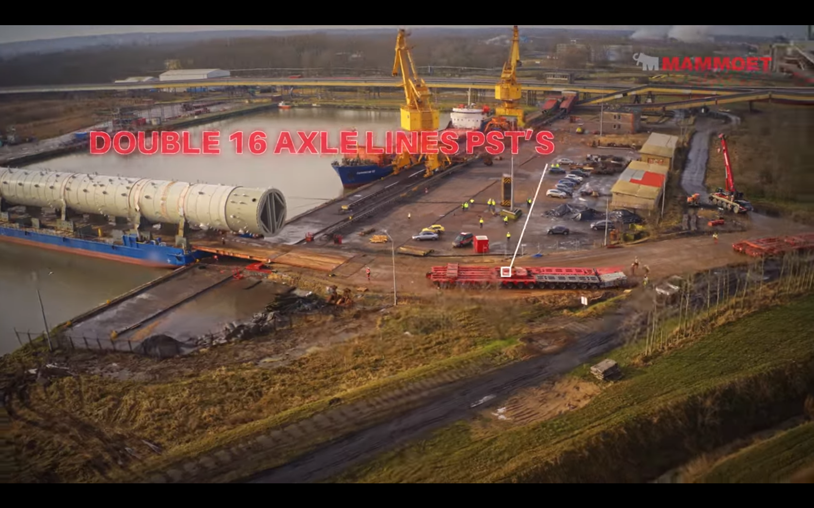

# A case for a lost cizilization

-> Show thyself

[According to
Nationalgeographics](https://www.nationalgeographic.org/article/key-components-civilization/#:~:text=Civilizations%20first%20appeared%20in%20Mesopotamia,on%20every%20continent%20except%20Antarctica.),
a civilization is a complex way of life that came about as people began to
develop networks of urban settlements. They also state, that the earliest
civilizations developed between 4000 and 3000 BCE, roughly 6000 years ago in
Mesopotamia, which is now Iraq.

Over the last couple of decades, we've gained a fairly good understanding of
how ancient civilizations, including those of the Egyptians, Babylonians,
Greeks and Romans, lived and what kind of buildings they constructed.

Interestlingly, all around the world, we can find enigmas, mysterious artifacts
and objects that contradict our current understanding of the history of humans.
I'm going to highlight some of these enigmas and make a case for a lost
civilization, that was capable of successfully completing mind-boggeling
achievements that we struggle with today or we simply do not know how to
replicate.

Before we dive into some examples, I would like to show how we're carrying out
some of the most difficult tasks in our modern civilization and compare the
technical requirements that we have to fulfill today in order to execute these
challenge.

---

[Source](https://www.youtube.com/watch?v=0Q3TjQ4IpiU)

In the year 2021, a company called Mammoet released a video on youtube to
showcase one of their projects. According to their website, they provide
"solutions to any heavy lifting or transport challenge". In said video, they
transported a splitter, which will be used to convert propane into recyclable
plastic pellets. The weight of the splitter is, according to the video title,
an estonishing 884 tons.

---

[Source](https://www.youtube.com/watch?v=0Q3TjQ4IpiU)

In order to transport such a heavy object, it hat to be carried by two special
vehicles, which distributed the weight to around 200 wheels each. Besides
moving such a weight, another challenge is lifting and lowering the splitter
which we can only do with electrically powered specialized heavy duty machines.

---

[Source](https://www.youtube.com/watch?v=0Q3TjQ4IpiU)

Despite having the best, state-of-the-art equipment and vehicles at hand, the
speed at which the splitter was moved with, was slow enough that the workers on
the ground were able to keep up with ease, meaning that it could not have been
more than 3 or 4 kmph.

This example illustrates perfectly that transporting heavy objects is something
we can't do with regular trucks but only with specialized machines that require
a massive amount of energy compared to what we can do just with our bodies.

---

 [Source](https://goo.gl/maps/7bW8R5ga4ULnEEh89)

In the middle east, specifically in Baalbek in Lebanon, the romans built a
temple called the temple of Jupiter. The temple itself is a stunning feat of
engineering done by the romans. There is plenty of scientific material as well
as a large amount of blog posts and videos that can be viewed to get an initial
understanding of what this temple looks like and what development the romans
must have gone through in order to erect such a huge temple.

---

[Source](http://www.selectstone.com/wp-content/uploads/2017/11/Balbec-7-1.jpg)

In one of the walls, surrounding the temple, a set of three stone blocks can be
found that are unlike many of those that can be found all around the globe.
These three stones are called the Trilithon, have an estimated weight of 800 to
900 tons each and are 19 meters long, 4.2 meters high and 3.6 meters thick.
They're supported by a set of smaller stone blocks, weighing between 300 and
400 tons each with only a length of about 11 meters.

To understand the extreme scale of these stone blocks, they have to be compared
to the size of a human. On this black and white screenshot you can see two
people standing in a hole of the wall that's just above the Trilithon.

---

[Source](https://upload.wikimedia.org/wikipedia/commons/a/a2/Baalbek-stoneofpregnantwoman.jpg)

Not far off the site is a quarry, which is the likely location for the stones
used in the wall containing the trilithon where the builders of the wall
abandoned their work for unknown reasons. What can be found there today is an
unfinished excavation of a stone block that's estimated to weight around 1000
tons. But as if that's not enough, it gets bigger and heavier.

---

[Source](https://upload.wikimedia.org/wikipedia/commons/5/57/Baalbek-_largest_stone.jpg)

Not too long ago we found another monolith in the same quarry with an estimated
weight of 1242 tons and a length of roughly 20 meters.

---

[Source](https://upload.wikimedia.org/wikipedia/commons/0/0b/Megaliths_in_Baalbek_quarry_10200.JPG)

But only 15 years later even the second monolith lost its seat on the thrown of
the heaviest monoliths in Baalbek as excavations around the Stone of the
pregnant woman revealed yet another megalith, just a bit shorter in length with
19.6 meters but a lot wider with a width of 6 meters. Its weight was estimated
to be 1650 tons, making it the heaviest stone that was ever quarried in human
history, including the history of our current civilization.

---

-> Speaking

Despite the question about who carved and shaped those megaliths or when they
were built, the answer to how this could have possibly been done remains a
mystery as even today with our modern machines, this would've been an
extraordinarily difficult task. How did they lift the stone several meters? How
did they transport it uphill?

Other work of the romans, who wrote down more or less everything they did and
knew, like columns of the temples that we can find in Rome and other places in
the Mediterraen area was carried out differently. Instead of transporting one
big megalith, stones are cut into pieces and then re-assembled later.

---

[Source](https://psu-gatsby-files-prod.s3.amazonaws.com/s3fs-public/styles/4_3_1000w/public/Continuous%20Low%20Seam%20Mining%20Machine%20Joy%20Global.jpg?h=622841c6&itok=DbgXCPHE)

In modern times, we use electrically powered machines that leave distinct
toolmarks. What these marks look like varies from machine to machine as the
toolmarks vary in size and different techniques must have been applied. Some
machines drill into stone while others cut stone with huge circular or swing
saws.

---

[Source](https://www.nationalattachments.com/assets/Uploads/Excavators/rock-saws/1.jpg)

We certainly do have the capability of cutting large stones out of the bedrock.
But in order to produce large quantities of stones, we have to rely on modern
machines as working these stones with hammers and chisles would simply be not
efficient enough on a large scale like we do it today.

---

[Source](https://i.pinimg.com/originals/6c/c5/2b/6cc52baf36020cec1fbad26b07e31855.jpg)

Without these machines, we'd struggle to produce a vast quantity of neatly cut
stones that we need for our modern constructions and architectrual designs.
Powering these saws with nothing but human labor is unimaginable on such a
large scale.

---

[Source](https://www.buildingcentre.co.uk/media/w1440/featured/barre-gray-polycor-quarry-web.jpg)

When looking at modern quarries like this one, we can see that the machines we
used leave distinct tool marks of which one could say, that it's obvious that
we used machines. Nothing on this structures indicates that the stones has been
work on with primitive hand tools like hammers and chisels.

---

-> Show thyself

Many examples that are being highlighted when talking about ancient megaliths
and stone work show perfectly cut stones of all kinds and sizes. But
surprisingly we also find many stones that still have toolmarks on them.
Besides the megaliths themselves we also know of many ancient quarries where
the stones have been excavated from.

---

[Source](https://hiddenincatours.com/wp-content/uploads/2014/11/44.jpg)

In some of the megaliths that were put into the walls in and around the temple
of Jupiter in Lebanon, the tool marks are still visible today. This stone
clearly shows evidence of tools being used. The marks indicate, that a tool was
used that had multiple teeth that left parallel grooves in the stone. If this
work would've been done with hammers and chisels, the lines visible in the
stone wouldn't be as parallel and by far not that long as they are as the
primitive tools can only remove so much of the material of the stone being
worked on.

---

[Source](https://www.youtube.com/watch?v=6mT9OCCVwBw)

More tool marks can be found on the stone of the pregnant woman on the
remaining rock that still underneath the megalith. When examining the tool
marks closely, it's clear that these marks could not have been produced with
the tools of the people who we attribute with having worked on these stones.
The angled cuts in this particular example are too symmetrical for having been
created with primitive hand tools. The marks differ in style from the ones on
the stone in the wall though, indicating that the technique used to separate
the stone from the bedrock was a different one than the one we can see on the
wall's block.

---

-> Show thyself

Now that we've established a basic understanding for the work on stones in
ancient times, we need to examine whether this is a rare occursion or if this
phenomenon could be observed on a bigger scale as a civilization, that's
supposedly capable of creating and using powertools must have had the
technology to inhabit more places on the globe than just the middle east.  And
indeed, we can find these tool marks all around the globe.

---

[Source](https://goo.gl/maps/4dpQCWuucCZQY9mm8)

This picture has been taken at the Kailasa temple in India. The temple has been
carved straight out of the bedrock and was finished to a jaw-dropping level of
precision, covered with details that would challenge us with our modern tools
even today.

---

[Source](https://goo.gl/maps/ovqjPFQvH3s3pCFV9)

But in this case, it's not the temple that we're going to take a look at but
the enclosure itself as it has not been finished like the temple and tool marks
are still visible and exhibit parallel, long lines which do not reseble
anything that would've been left by using primitive technology.

---

[Source](https://www.indiana-stones.de/s/cc_images/cache_59302303.jpg)

Even Germany has stones with these kinds of toolmarks on a site called
Felsenmeer, which translates to boulder ocean. Several pieces of rock can be
found there that have ancient machine tool marks as well as a column, with
toolmarks, too, of course.

---

[Source](https://www.youtube.com/watch?v=GnQESXFVloo)

The most intruiging stone that can be found is this one though as it displays
both rough machine marks at the top as well as a surface that appears to have
been cut with a saw. The striations and grooves are still visible, especially
when the stone is wet.

---

[Source](https://youtu.be/6KUDu40BC5o?t=1297)

Egypt is one of the best sources for these precision cutting tool marks as many
examples can be found in many of the sites. This stone must have been cut with
an enormous circular or swing saw. Modern machines of this size can vary in
thickness but none of them are as thin as the one that's been used here. The
rounded edge indicates that the tip of the saw must've been only a couple of
millimeters wide. We also see parallel striations and grooves that are
impossible to reproduce without power tools today.

---

-> Show thyself

Before we get into examples of what these stones were used for, we should take
a closer look at the quarries where these megaliths have been taken from. The
traces left in the stone at the ancient quarries can give us a good idea of the
capabilities the ancient stone cutters were able to perform

---

https://www.youtube.com/watch?v=XB29y_r6NJs

In the Crimea near Sevastopol, a small quarry can be found with an entrance
that is too small to fit most of our modern machines inside. There's no
official way to find it, there are no signs and no road going there.

---

[Source](https://www.youtube.com/watch?v=XB29y_r6NJs)

Inside we can find precisely cut stone

---

[Source](https://www.youtube.com/watch?v=XB29y_r6NJs)

As well as precision cuts only a couple of millimeters wide but up to 20
centimeters deep.

---

[Source](https://www.youtube.com/watch?v=XB29y_r6NJs)

Other quarries on the outside display clear evidence of machine cuts as can be
seen here. The wall has been cut into. Another back-cut has been made which is
visible because some of the stone broke away, revealing the flat surface that's
been produced by the cut itself.

---

-> Show thyself

The quarries can be quite impressive. In South-America we can find a lot of
places, especially in Peru and Bolivia, where ancient people cut into the bed
rock, leaving surfaces that we can't explain with the tools of the known
civilization of those areas. There are different tool marks that can be found
in the quarries. One of the most impressive quarries I have seen so far is in
Japan. The prominent tool marks that can be found there are still full of
details despite the heavy weathering that must've occurred here over the eons.

---

 [Source](https://goo.gl/maps/KqaeidM3XTPUh7136)

This quarry, which is quite close to Tokyo, where we can find megalithic
and polygonal architecture as well, is one of the biggest in the world.
Mountains literally have been moved here.

---

 [Source](https://goo.gl/maps/zuLp7vQJ23vXu8Az6)

The size of this site is unimaginable. When looking through images of people
who have been there, you can see that the extraction technique that's been
applied, makes one believe that the people who took the stones could do it with
such ease as if they were cutting through soft butter with a chef's knive.

---

 [Source](https://goo.gl/maps/A2QA2YhsPy1p9eXx5)

Only when looking at the site from an aerial perspective, one can see that some
huge portion of the original mount has been taken away. In the center of the
picture, on a viewing platform, you can see some people to get an idea of the
size of this place.

---

[Source](https://goo.gl/maps/J2VwfyHNXfAET4xA6)

One of the most interesting photos I could find is this one. The horizontal
tool marks are identical in shape to the ones that can be found all over the
place and must've been the main technique applied to quarry stone. Every
horizontal groove contains vertical, slightly angled grooves. Even an untrained
eye can see that this has not been done with hammers and chisels. If I showed
this picture to someone today without the information that this is actually an
ancient quarry and asked what kind of machine would produce such marks, no one
would respond with "I guess it was hammers and chisels, maybe?"

---

[Source](https://upload.wikimedia.org/wikipedia/commons/1/1a/Longyou_Xiaonanhai_Shishi_2016.12.11_15-49-15.jpg)

Not too far away is another quarry with striking similarities. This is the
Longyou quarry in China. As you can see on the pillar on the right side of the
picture, the toolmarks look almost identical to the ones that can be found in
the quarry in Tokyo

---

[Source](https://www.sanliurfa.bel.tr/icerik/234/625/bazda-magaralari)

The same quarring style can be found on the other side continent in a quarry
called "Bazda Mağaraları" in Turkey. This site displays a set of different
quarrying techniques still visible today.

---

[Source](https://lh3.ggpht.com/p/AF1QipNpiivz-_Nmo10a7XMxh0YiMfM20dy7daaxdVHm=s1024) 

Not too far away from Turkey is the unfinished obelisk in the Aswan quarry in
Egypt. If this obelist had been finished, it ["would have weighed nearly 1,090
tonnes (1,200 short tons), a weight equal to about 200 African
elephants"](https://en.wikipedia.org/wiki/Unfinished_obelisk). The toolmarks we
can see here are different from the ones we've seen in the previous examples.
These are not meant to end up on the finished obelisk, so assuming that these
were made like this with hammers, chissels or pounding stones does not make
much sense as that would've made the whole quarrying process unnecessarily more
complicated. It looks more like that - whatever technology had been applied, it
was able to cut through the rock with relative ease.

---

-> Show thyself

But Japan has a lot more to offer. There is another structure that appears to
be a quarry as well but its location adds more questions rather than answers as
it's fully submerged under water.

---

 [Source](https://goo.gl/maps/XC2YTe1sUvbaNPBj8)

The so called Yonaguni Monument is a structure that - according to mainstream
archeology - is completely natural and was created due to earthquake activity
which is known to cause straight cracks as well.

---

 [Source](https://goo.gl/maps/FxzG1iQADkhMu74G7)

The site has such a large amount of unusual shape with 90 degree angles that
the probability for it having been formed naturally is - although possible -
highly unprobable.

---

-> Show thyself

By now we've seen that there far distanced places on this planet with big
pieces of stone that might have been worked on with machines. But if people
were once capable of inventing and creating machines on a large scale, they
must've had the capability to work stone to a very fine detail. Now it's time
we get into the topic of precision as this is where things get really hard to
explain.

Before we look at some examples though, we need to talk about the hardness of
various materials as some of the objects I'll present are made from stone
that's incredibly hard.

In order to express the hardness of a material, the actual value is express
with a number on the Mohs hardness scale which range from 0 to 10 and defined
the resistence of a material to being scrached. The only material that has a
level of 10 is diamond, everything else has a value lower than ten. On this
scale, the hardness of iron is somewhere between 4 and 5, depending on the
quality of the iron.

In egypt we find many objects finished to an incredibly high level of prevision
made from granit, quartz and other equally hard materials. These materials
range between 6 and 7 on the Mohs hardness scale.

Working on these materials with other stones of the same hardness type is
possible but a crude and hard work. Imagine cutting a tree with a wooden axe.

---

[Source](https://www.youtube.com/watch?v=ziJtaWfztwc)

In Cusco, Peru, the city contains some walls with stones that do not resemble
any building style that we're using today. The so-called polygonal masonry
that's been applied here is incredibly precise. The edges are rounded, no stone
looks like the other and the stones are actually granit, making it extremely
difficult to shape them precisely.

---

[Source](https://www.youtube.com/watch?v=ziJtaWfztwc)

The stones are interlocking in such a way that these constructions are more
earthquake proof than most modern structures. We don't know the purpose of
building like this, but earth-quake proofing is definitely in the realm of the
possible - at least as one possible reason as there could be multiple,
including culturel/religious reasons.

It's important to mention that - if we wanted to replicate this today - it'd
require carefull planning and execution as you can't just saw a stone into
several pieces and then fit them together again as the cut surfaces, left by
the cutting device, are not perfectly matching and therefore would need
adjustmest before putting them together.

---

[Source](https://i.pinimg.com/564x/e0/4a/fe/e04afe2623e0fc3e91432ef88b80e045.jpg)

The precision does not just cover the corners between stones but also shaping
stones in such a way that they're going around corners.

---

[Source](https://i.pinimg.com/originals/56/eb/15/56eb150ef52833daefd670c2a2ce739c.jpg)

This kind of polygonal masonry can also be found in egypt. This particular
example is in the valley temple in Giza.

---

[Source](https://zoomeboshi.files.wordpress.com/2020/03/valley-temple-corner.jpg?w=625)

Although it seems that this is rather difficult, this pattern of shaping stones
is actually quite common in Egypt and Peru.

---

[Source](https://megalithicmarvelscom.files.wordpress.com/2020/10/pyp-432-copy.jpg)

Many sites in Peru include so-called false doors and false windows which are
actually just niches or man-made alcoves. This can be seen both cut straight
into the bedrock as well as built purposefully with polygonal masonry.

---

[Source](https://live.staticflickr.com/4100/4752325276_52e65b3171_h.jpg)

If I now asked you were you think this picture has been taken, if you don't
know already, most likely you'd answer with: In Peru of course, you just told
us that they liked to do that over there! But this example is actually in Alba,
Italy. Polygonal masonry can be found all over the globe.

---

[Source](https://i.pinimg.com/originals/78/5d/34/785d340bf299561a05e11568c40dfc10.jpg)

We can find it in Greece

---

[Source](https://www.facebook.com/photo?fbid=964307867097735&set=pcb.964307953764393)

In Turkey

---

[Source](https://www.theancientconnection.com/the-anti-seismic-megalithic-walls/)

On Easter Island

---

[Source](https://goo.gl/maps/UVN2iAv9qRFoE9v57)

In Japan

---

[Source](https://goo.gl/maps/j6CiLQYGPRWGJdop6)

In New Zealand

---

[Source](https://www.rbth.com/travel/331795-russias-megalithic-tombs-dolmens)

We even find them in Russia.

---

[Source](https://prosemenov.ru/en/samye-izvestnye-megality-rossii-50-foto-gigantskie-drevnie-megality/)

Russia has some quite impressive examples. But they do not look like the walls
that we can find in Peru or the Pyramids and temples that are located in Egypt.

---

[Source](https://prosemenov.ru/en/samye-izvestnye-megality-rossii-50-foto-gigantskie-drevnie-megality/)

None the less, the megaliths that can be found in Russia are enormous.
Considering that humans in the past were able to move 900 ton stones in
Lebanon, there can't be any objections to humans being capable of doing the
same further north.

---

[Source](https://prosemenov.ru/en/samye-izvestnye-megality-rossii-50-foto-gigantskie-drevnie-megality/)

The cuts into the bedrock has nothing but 90 degree angles. One of the cuts
into the bedrock filled up with water and looks like a pool.

---

-> Show thyself

So, let's summarize what we've seen up to this point:
* At some point in the past, stones with such a high weight were transported
  that even with modern tools, we're struggle and need specialized, high power
  tools,
* the tool marks left on many ancient megaliths seem to indicate that they were
  produced with high power machines, to some degree they even look similar to
  modern machine tools,
* tool marks can be found all around the world,
* the amount of materials that must've been moved at some point is far beyong
  the capability of a primitive culture with primitive tools,
* the precision of the stone in stone walls is astonishing,
* and the polygonal masonry can be found all over the globe

But we're not done yet. There are still some things that show such a high level
of perfection, that it's virtually impossible to claim that these objects were
made with hand tools

---

[Source](https://www.youtube.com/watch?v=nYhf_5TXPP0)

The team behind the documentary "builders of the ancient mysteries" measured
the flatness of the walls in some caves in India. What they measured was the
deviatation from perfect flatness on the walls. The results are beyong what any
culture with primitive non-powered tools could have produced. In this
particular example it's 3.008 micrometers. That's 0.003 millimeters or 0.000003
centimeters.

---

[Source](https://goo.gl/maps/V54tXcbNRFb3sxbu6)

On this statue in the Cairo museum, recorded by Ben from UnchartedX, which is
made from a very hard material, comparible and possibly even harder than
granit, the rib cage has been worked into the stone and then was polished
completely so that the reflection of the light makes it appear as if there was
a real rib cage in the statue.

---

[Source](https://goo.gl/maps/uN1aKPgMJcNfSsZz8)

In tunnels under the pyramid of Djoser alone archeologist found more than
40,000 vases. Many of them are made from extremely hard materials like granit,
quartz, etc. These vases are almost perfectly symmetrical, but what's even more
interesting is that their walls are quite thin. The outer shape has been
reproduced on the inside as well. An achievment we couldn't even try to
replicate today on such a scale. It wouldn't be impossible for us to create a
machine that could work on granit and produce a vase like this, but only with
high power tools, laser tools for measuring and we'd still be quite far away
from producing items like these in masses.

---

[Source](https://hiddenincatours.com/lost-ancient-technology-of-egypt-stone-bowls-of-saqqara/)

Some of these items look like there were soft and some point so that shapes
like this one could've been made. What really happened is still a mystery to
us. Many of these object appear to have been worked on on a lathe. This
particular object still has a circle imprinted on the bottom on the inside.

---

[Source](https://www.theancientconnection.com/the-anti-seismic-megalithic-walls/)

We can find this level of precision in the walls of Egypt and Peru as well.
These walls, mainly consisting of medium sized and some large blocks also
contain very small pieces that were fittes just as well.

---

-> Show thyself

Last but not least I would like to show some similarities that can be found
through out all of the ancient sites all over the globe which has nothing to do
with precision itself but indicates that all these sites have a connection. But
I won't get too deep into these topics and simply highlight and recommend other
resources.

---

 [Source](https://www.youtube.com/watch?v=dOaDroOyhgY)

The "Ancient History Criticisms" YouTube channel has some excellent videos
about similarities between all kinds of structures. Many of his videos are
about the nubs as you can see were left on the stones.

---

 [Source](https://youtu.be/BTd1fRCAvR4?t=516)

The "Bright Insight" YouTube channel has some interesting videos as well,
including one where he compares a sarcophagus found in Japan with those found
in Egypt. Interestingly it's not just the fact that these are both stone boxes
with a lit but also the entire design and features that make the sarcophagi so
similar.

---

 [Source](https://youtu.be/KFuf-gBuuno?t=2451)

The "UnchartedX" YouTube channel has many great videos of high quality. One of
them discusses the tube drill phenomenon and addresses a lot of arguments made
by alternative and mainstream archeologists. Besides the tube drill video,
there are plenty of other videos about all sorts of things like the sarcophagi
in the Serapeum of Giza. He as well has a highly compelling video about why
there most likely was an advanced civilization with andvanced technological
capabilities.

---

-> Show thyself

I think at this point it's more than obvious that we need to question our past
more and be more open to the idea that humas were much more advanced that we
think today. The human history, not just that of the homo sapiens sapiens,
streches some million years back into the past.

Could it be possible that at least one of those species was capable of reaching
an advanced state? I'd say it's certainly possible and with all the evidence
for power tools, it's even probable. Since the discovery of Gobekli Tepe in
Turkey, which is 12,000 years old where people supposedly discovered how to do
farming and megalithic stonework over night and the correlation of the date of
the younger dryas, which describes a timespan between 12800 and 11600 years ago
which started with a sudden global freeze, bringing back the ice age and a very
sudden warming even that led to a rise of the sea level by more than a hundret
meters, we should talk more about the possibility of a lost ancient
civilization which is mentioned and described in all ancient cultures around
the world.

--- ## TODO
* https://www.youtube.com/watch?v=XB29y_r6NJs
* https://www.theancientconnection.com/the-anti-seismic-megalithic-walls/
